<p align="center">
  
</p>

<p align="center">
  
</p>

<p align="center">
  
</p>

<p align="center">
  
</p>

---

## 👋 About

Frontend developer (self-taught since 2023) building clean, responsive UIs with **React** and **Tailwind CSS**.
Currently learning the backend: **Node.js → Express → MongoDB → REST APIs**, aiming for full stack.
Open to collaborations and open source.

**Stack:** HTML · CSS · JavaScript · React · Tailwind CSS · Bootstrap · Git · GitHub · Netlify

---

## 🚀 Projects

<!-- TODO: add live demo links + screenshots for your 2-3 best projects -->

| Project | What it is | Stack |
| :-- | :-- | :-- |
| [Project3](https://github.com/Rishp-3/Project3) | 21 React projects collection | React, Vite |
| [Java-Project](https://github.com/Rishp-3/Java-Project) | Java learning repo — 27 modules, console projects | Java |

---

## 📊 Stats

### ⏱️ WakaTime weekly stats

<!--START_SECTION:waka-->

```txt
HTML         2 hrs 29 mins         ████████▓░░░░░░░░░░░░░░░░   34.73 %
Java         2 hrs 19 mins         ████████░░░░░░░░░░░░░░░░░   32.36 %
CSS          1 hr 23 mins          █████░░░░░░░░░░░░░░░░░░░░   19.38 %
Markdown     28 mins               █▓░░░░░░░░░░░░░░░░░░░░░░░   06.70 %
Git Config   12 mins               ▓░░░░░░░░░░░░░░░░░░░░░░░░   02.94 %
```

<!--END_SECTION:waka-->

---

## 📈 Activity graph

<p align="center">
  
</p>

## 🏆 Trophies

<p align="center">
  
</p>

## 🐍 Contribution snake

<p align="center">
  
</p>

---

<p align="center">
  <a href="https://github.com/Rishp-3"></a>
</p>

<p align="center">
  <a href="https://github.com/Rishp-3">GitHub</a> ·
  <a href="https://linkedin.com/in/rishp3">LinkedIn</a> ·
  <a href="https://x.com/rishp_3">X</a> ·
  <a href="https://instagram.com/rishp_3">Instagram</a> ·
  <a href="https://facebook.com/rishp3">Facebook</a> ·
  <a href="https://youtube.com/@rishp3">YouTube</a> ·
  <a href="https://codepen.io/Rishp-3">CodePen</a> ·
  <a href="https://stackoverflow.com/users/32493179">Stack Overflow</a> ·
  <a href="https://medium.com/@rishp-3">Medium</a> ·
  <a href="https://reddit.com/user/Rishp-3">Reddit</a>
</p>

<p align="center">
  <a href="https://github.com/Rishp-3?tab=followers"></a>
</p>
